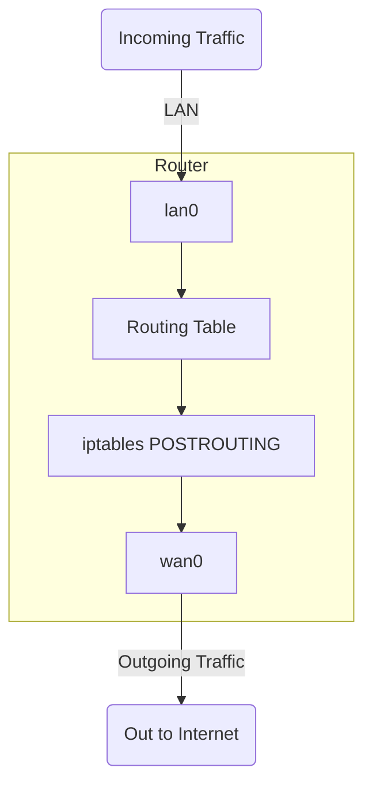

# Linux Network Namespaces based NAT Router

In this repository is presented an example of PTF tests usage

## Initial setup
---

1. Initialize .venv and setup the required packages

```bash
$ python -m venv venv
$ source .venv/bin/activate

(.venv) $ pip install ptf scapy
```

## Router setup

The router is a linux namespace with two veth interfaces (`in -> lan0` and `out <- wan0`)

Inside the router I've enabled forwarding and set up the iptables to masquerade traffic between lan and wan 

Look for `./setup_router.sh` for details about installation

Flowchart model for router setup:


### Starting the router

To set up the router execute script `./start_router.sh`. It will create 2 netns's: `router` and `test`

from `test` namespace we can run PTF tests

## PTF tests

PTF tests are located in directory `./tests/`, and consist of 2 parts:

- general routing test `routing`
- NAT(NAPT) function tests `nat`
    - tcp/udp/icmp direct throughput
    - tcp/udp/icmp return to client behind NAT

In order to run tests, you should:

1. Complete initial setup
2. Start router
3. Enter `test` namespace:
```
# ip netns exec test bash
```
4. Activate venv:
```
# source .venv/bin/activate
```
5. Run PTF tests specifying interfaces:
```
ptf --interface 0@in --interface 1@out --test-dir tests/ --verbose
```
